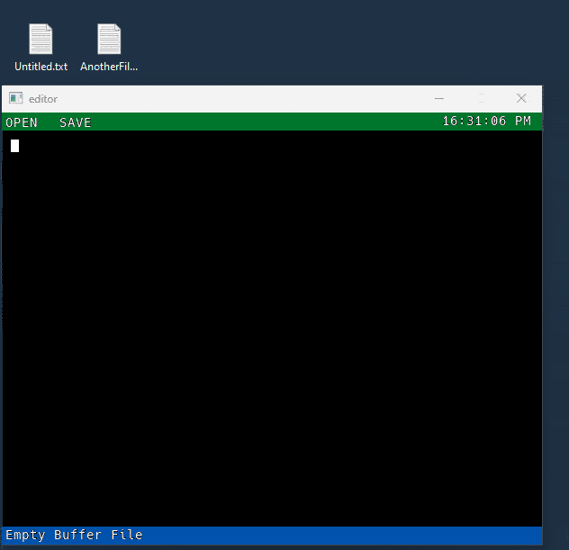

# Simple gui text editor

**Made with raylib, no font dependencies**

### Features

1. Open files (drag and drop them onto the window)
2. Open files with the menu dialogue
3. Save files (Ctrl+S)
4. Save files with the menu dialogue
5. Cursor Movement (up,down,left,right)
6. Deleting characters
7. Display latest opened file

### Missing

1. Auto-formatting text based on deletes
