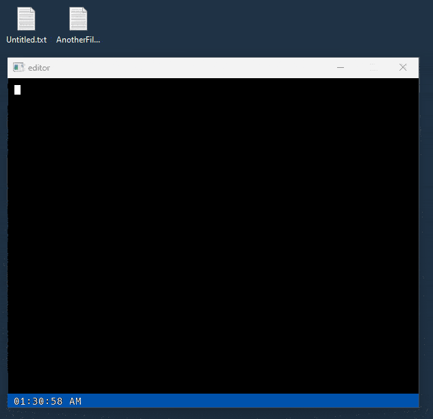

# Simple gui text editor

**Made with raylib, no font dependencies**

### Features

1. Open files (drag and drop them onto the window)
2. Save files (Ctrl+S)
3. Cursor Movement (up,down,left,right)
4. Deleting characters

### Missing
1. Auto-formatting text based on deletes
